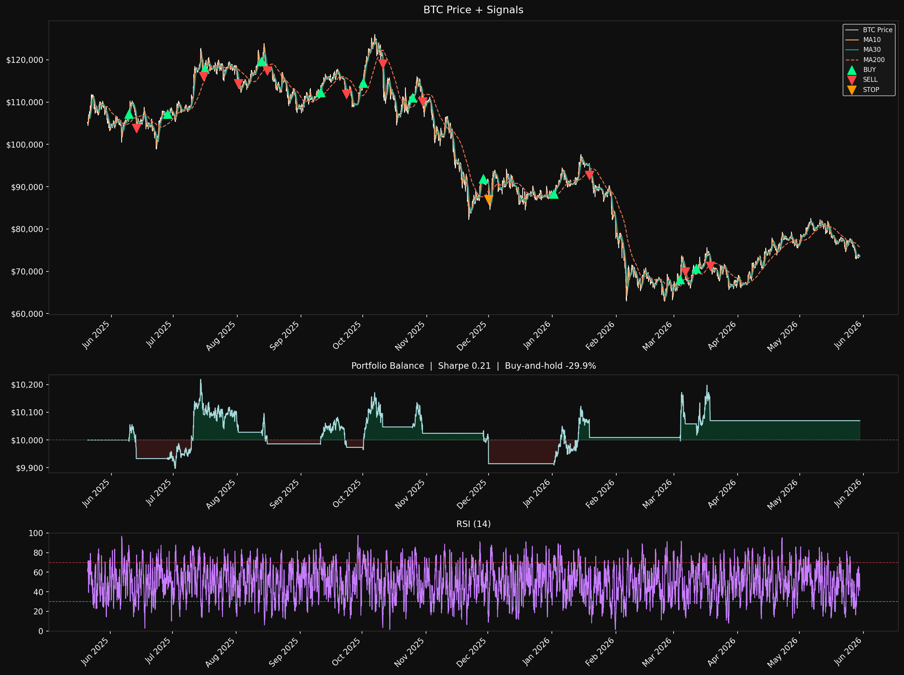

# BTC Quant Trading Bot

A modular Python project for backtesting a Bitcoin trading strategy, training an XGBoost model to filter trade entries, and paper-trading the result live against Binance's testnet — all viewable from a Streamlit dashboard.



## Features
- Binance hourly market-data ingestion for `BTCUSDT`
- 29-feature technical dataset: moving averages, RSI, MACD, Bollinger Bands, ATR, volume stats, candle microstructure, and time-of-day features
- Fee-aware long-only backtest with a hard stop, a trailing stop, and regime-aware position sizing
- XGBoost classifier (tuned via `GridSearchCV` + `TimeSeriesSplit`) gates trade entries by predicted probability of price increase
- Trade export to `trade_log.csv`, chart export to `dashboard.png`, ML metrics export to `ml_report.csv`
- Live paper-trading loop against Binance testnet, with state persisted to `live_state.json`
- Streamlit dashboard with a Backtest tab and a Paper Trade tab

## Project Structure
- `bot.py` — runs the full backtest pipeline and regenerates outputs
- `ml_experiment.py` — runs only the ML experiment and exports `ml_report.csv`
- `live.py` — CLI entry point for live/paper trading (single run or hourly loop)
- `app.py` — Streamlit dashboard (Backtest + Paper Trade tabs)
- `quant_bot/data.py` — data loading and indicator creation
- `quant_bot/ml.py` — feature engineering, dataset building, and XGBoost training
- `quant_bot/backtest.py` — trading simulation with regime-aware sizing and ML gating
- `quant_bot/strategy.py` — hard-stop / trailing-stop exit rules
- `quant_bot/live_trader.py` — one-iteration live decision loop, used by `live.py` and the Streamlit paper-trade tab
- `quant_bot/binance_client.py` — minimal signed REST client for Binance testnet/production
- `quant_bot/reporting.py` — chart and CSV exports
- `quant_bot/pipeline.py` — shared orchestration for scripts and the dashboard
- `quant_bot/models.py` — result dataclasses
- `quant_bot/config.py` — all tunable constants and defaults
- `tests/` — unit tests for the strategy exit rules and the ML pipeline

## Backtest Strategy
- Entry: `MA_10` crosses above `MA_30`
- Trend filter: price stays above `MA_200` and `MA_200` is rising
- RSI filter: only buy when `RSI < 70`
- ML filter: XGBoost must predict at least 55% probability of price increase
- Regime-aware sizing: confirmed uptrends (price ≥3% above a rising `MA_200`) use a larger 40% position and a wider 10% trailing stop; choppy markets use a conservative 20% position and a 5% trailing stop
- Hard stop: 4% below entry
- Fees: 0.1% at entry and exit

## Machine Learning
`quant_bot/ml.py` builds a 29-feature dataset (multi-horizon returns, MA gaps, RSI/MACD momentum, volatility, volume, candle shape, and time-of-day) and trains an `XGBClassifier` to predict whether price will be higher after a configurable horizon (default: 10 candles). Hyperparameters are tuned with `GridSearchCV` over a `TimeSeriesSplit` cross-validator so no future data ever leaks into training. The backtester only applies the ML gate on candles after the model's training cutoff, so there's no lookahead bias.

## Live / Paper Trading
`quant_bot/live_trader.py` runs the same entry/exit logic as the backtest against a live Binance connection:
1. Fetch the latest candles and recompute all 29 features
2. Check exit conditions first if a position is open (hard stop / trailing stop)
3. Otherwise check the MA crossover, trend filter, RSI filter, and ML gate for a new entry
4. Place a market order via `quant_bot/binance_client.py`
5. Persist cash, position, and trade history to `live_state.json`

By default everything runs against Binance's **testnet** (fake money, real-time prices) — see [testnet.binance.vision](https://testnet.binance.vision/) for free API keys. Going live with real money requires passing `--live` to `live.py` **and** setting `BINANCE_LIVE=1` in the environment, a deliberate double confirmation.

```bash
python live.py            # one decision iteration (testnet)
python live.py loop       # keep checking every hour (testnet)
python live.py --live     # production — requires BINANCE_LIVE=1
```

## Streamlit Dashboard
```bash
streamlit run app.py
```
- **Backtest tab** — configure symbol/interval/lookback/date range, rerun the pipeline, and view metrics, the chart, the trade log, and ML feature importance
- **Paper Trade tab** — connect to Binance testnet with your API credentials, view balances and current position, trigger a trade check, and view trade history and equity curve

## Setup
```bash
.\.venv\Scripts\Activate.ps1
pip install -r requirements.txt
python bot.py
python ml_experiment.py
streamlit run app.py
```

If PowerShell blocks activation, run without activating:
```bash
.\.venv\Scripts\python.exe bot.py
```

For paper trading, copy `.env.example` to `.env`, fill in testnet API keys from [testnet.binance.vision](https://testnet.binance.vision/), and load it into your shell before running `live.py` or the Streamlit app.

## Running Different Market Periods
```bash
python bot.py                    # last 365 days ending today (default)
python bot.py bull_2021          # 2021 bull run (BTC $10k → $69k)
python bot.py bear_2022          # 2022 crash
python bot.py bull_2023          # 2023 recovery
python bot.py bull_2024          # 2024-25 bull run
python bot.py cycle_2years       # last 2 years (bull + bear)
python bot.py cycle_3years       # last 3 years (full cycle)
python bot.py 2021-11-10 365     # custom: 365 days ending on a specific date
python bot.py 730                # custom: last 730 days ending today
```

## Outputs
- `dashboard.png` — saved chart of price, signals, equity curve, and RSI
- `trade_log.csv` — one row per closed backtest trade
- `ml_report.csv` — saved ML metrics and feature importance
- `live_state.json` — persisted paper-trading state (cash, position, trade history)

## Testing
```bash
python -m unittest discover -s tests
```

## Limitations
- Results depend on the market data available at run time
- The ML model is not a guaranteed trading edge — it's a probability filter on top of a rule-based strategy
- The project is a prototype, not a production trading system
- Live trading defaults to testnet; going live with real funds carries real financial risk
